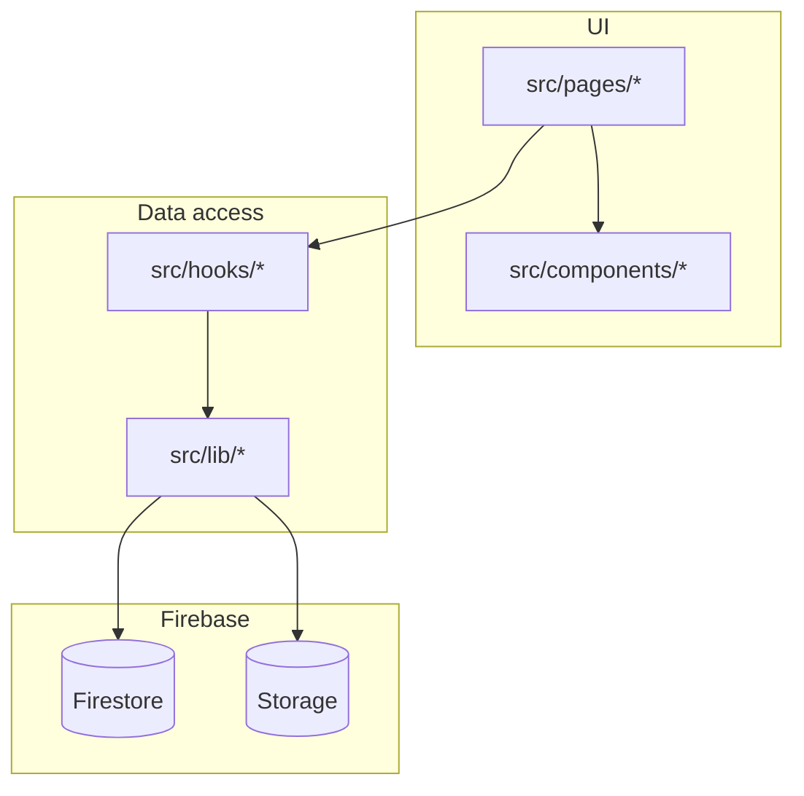

# Architecture

Recipe Vault is a single-page application: React 18, TypeScript, Vite, client-side routing, and Firebase as the backend.

## Bootstrap

- `index.html` loads `src/main.tsx`.
- `main.tsx` mounts the app under `StrictMode`, wraps the tree in **`QueryClientProvider`** (TanStack Query), then **`AuthProvider`** (Firebase Auth state), then `BrowserRouter`, and imports global styles (`index.css`).
- `App.tsx` defines routes: public **`/login`** and **`/register`**, then an auth gate (**`RequireAuth`**) wrapping **`AppLayout`** and all main app pages via `<Outlet />`.

## Routing

Routes live in `src/App.tsx`. Unauthenticated visitors are redirected to **`/login`**. After sign-in, primary routes render inside `AppLayout`.

| Path | Page component | Notes |
|------|----------------|--------|
| `/login` | `LoginPage` | Email/password, Google, password reset |
| `/register` | `RegisterPage` | Email/password, Google |
| `/` | `HomePage` | |
| `/recipes` | `RecipeListPage` | List and search entry (`?search=true` on mobile) |
| `/recipes/new` | `RecipeEditorPage` | Create |
| `/recipes/:id` | `RecipeDetailPage` | |
| `/recipes/:id/edit` | `RecipeEditorPage` | Edit |
| `/organize` | `OrganizePage` | Tabs: categories (default), tags (`?tab=tags`) |
| `/categories` | — | Redirects to `/organize` |
| `/tags` | — | Redirects to `/organize?tab=tags` |
| `/pantry` | `PantryPage` | |
| `/ingredients` | `IngredientsPage` | Master ingredients catalog |
| `/suggestions` | `SuggestionsPage` | “What can I cook?” |

**Recipe ingredient alternatives:** Optional per-line **`substituteLinks`** (extra catalog/custom masters that OR-match pantry and suggestions) are edited in **`RecipeEditorPage`** and listed read-only on **`RecipeDetailPage`**. See [Domain logic — Recipe ingredient alternatives (substituteLinks)](./domain-logic.md#recipe-ingredient-alternatives-substitutelinks).

## Layout and navigation

`AppLayout` provides:

- Sticky top header with desktop nav links, **signed-in email** and **sign out**, and a mobile search shortcut to `/recipes?search=true`.
- Main content area with `max-w-5xl` and an `<Outlet />` for the active route.
- Fixed bottom navigation on small screens (`md:hidden`).
- `ScrollToTop` on pathname changes.

Nav item order and labels are defined in `AppLayout` (`navItems`).

## Layering convention

- **Pages**: route-level composition, URL/query handling, wiring hooks to UI.
- **Components**: reusable UI (including `components/recipe`, `components/ui`, `components/layout`).
- **Hooks**: load and mutate domain data, often wrapping `lib/firestore` and related helpers.
- **Lib**: Firebase initialization, Firestore CRUD, Storage uploads, search index building, pure domain functions, TanStack Query client factory and **query keys** (`queryClient.ts`, `queryKeys.ts`).

Types in `src/types/` mirror persisted shapes where relevant; see [Data and Firebase](./data-and-firebase.md).

## Server state cache (TanStack Query) — phase 1

[TanStack Query](https://tanstack.com/query/latest) caches async reads and deduplicates in-flight requests. **Phase 1** applies it only to **reference data** that many screens share:

| Query key | Hook | Firestore |
|-----------|------|-----------|
| `['tags', uid]` | `useTags` | `tags` for the signed-in user |
| `['categories', uid]` | `useCategories` | `categories` for the signed-in user |
| `['masterIngredients', uid]` | `useIngredients` | merged catalog + user `ingredients` |

- **`staleTime`:** `REFERENCE_DATA_STALE_MS` in `src/lib/queryKeys.ts` (5 minutes). While data is fresh, mounting another component that uses the same hook does **not** trigger a redundant `getDocs` for that list.
- **Mutations:** `add` / `update` / `remove` (and categories’ `edit`) still call Firestore, then update the cache with **`queryClient.setQueryData`** so the UI stays correct without an extra refetch.
- **`refresh`:** still exposed from each hook; it runs TanStack’s **`refetch`** for that query (forces a network read).

Recipes, pantry, and single-recipe loads still use the previous `useEffect`-based hooks or page-level fetches until a later phase.

**Planned next steps** (query keys, files to touch, acceptance checklists): [TanStack Query migration roadmap](./tanstack-query-roadmap.md) — **Phase 2** (pantry), **Phase 3** (recipe lists; optional **3b** single recipe).

When adding new cached resources, define stable **`queryKey`s in `queryKeys.ts`** and document them in this section and in the roadmap when applicable.

## Path alias

Vite resolves `@/` to `src/` (`vite.config.ts`). Imports use `@/components/...`, `@/lib/...`, etc.
