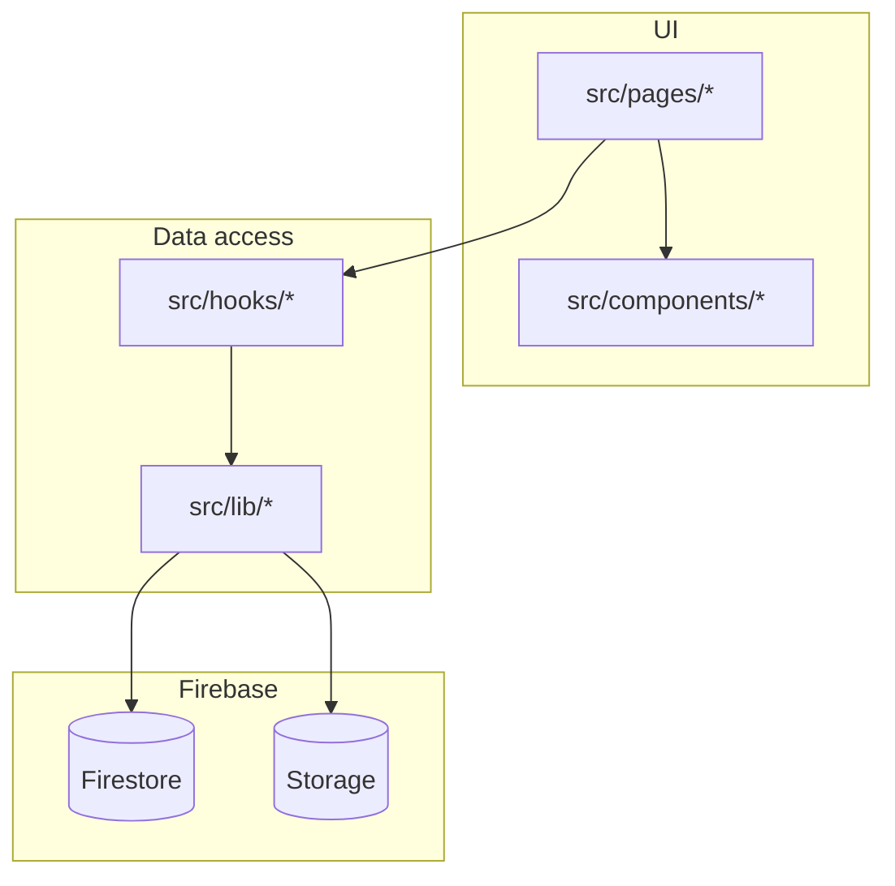

# Architecture

Recipe Vault is a single-page application: React 18, TypeScript, Vite, client-side routing, and Firebase as the backend.

## Bootstrap

- `index.html` loads `src/main.tsx`.
- `main.tsx` mounts the app under `StrictMode`, wraps it in `BrowserRouter`, and imports global styles (`index.css`).
- `App.tsx` defines all routes; page content renders inside `AppLayout` via React Router’s `<Outlet />`.

## Routing

Routes live in `src/App.tsx`. All primary routes are nested under `AppLayout` so the header and navigation stay consistent.

| Path | Page component | Notes |
|------|----------------|--------|
| `/` | `HomePage` | |
| `/recipes` | `RecipeListPage` | List and search entry (`?search=true` on mobile) |
| `/recipes/new` | `RecipeEditorPage` | Create |
| `/recipes/:id` | `RecipeDetailPage` | |
| `/recipes/:id/edit` | `RecipeEditorPage` | Edit |
| `/organize` | `OrganizePage` | Tabs: categories (default), tags (`?tab=tags`) |
| `/categories` | — | Redirects to `/organize` |
| `/tags` | — | Redirects to `/organize?tab=tags` |
| `/pantry` | `PantryPage` | |
| `/ingredients` | `IngredientsPage` | Master ingredients catalog |
| `/suggestions` | `SuggestionsPage` | “What can I cook?” |

## Layout and navigation

`AppLayout` provides:

- Sticky top header with desktop nav links and a mobile search shortcut to `/recipes?search=true`.
- Main content area with `max-w-5xl` and an `<Outlet />` for the active route.
- Fixed bottom navigation on small screens (`md:hidden`).
- `ScrollToTop` on pathname changes.

Nav item order and labels are defined in `AppLayout` (`navItems`).

## Layering convention

- **Pages**: route-level composition, URL/query handling, wiring hooks to UI.
- **Components**: reusable UI (including `components/recipe`, `components/ui`, `components/layout`).
- **Hooks**: load and mutate domain data, often wrapping `lib/firestore` and related helpers.
- **Lib**: Firebase initialization, Firestore CRUD, Storage uploads, search index building, pure domain functions.

Types in `src/types/` mirror persisted shapes where relevant; see [Data and Firebase](./data-and-firebase.md).

## Path alias

Vite resolves `@/` to `src/` (`vite.config.ts`). Imports use `@/components/...`, `@/lib/...`, etc.
